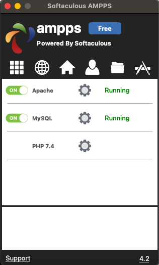
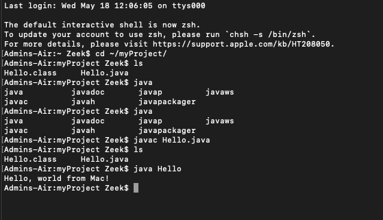
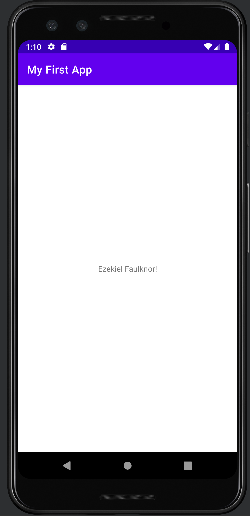

> **NOTE:** This README.md file should be placed at the **root of each of your repos directories.**
>
>Also, this file **must** use Markdown syntax, and provide project documentation as per below--otherwise, points **will** be deducted.
>

# LIS4381 - Mobile Web Application DevelopmentCourse Title

## Ezekiel Faulknor 

### LIS4381 Requirements:

*Sub-Heading:*

1. Distributed Version Control with Git and Bitbucket
2. Development installation 
3. Chapter Questions (Chs 1,2)

#### README.md file should include the following items:

* Screenshots of AMPPS instilation 
* Screenshots of running java Hello
* Screenshots of running Android Studio - My First App
* git commands w/short descriptions

> This is a blockquote.
> 
> This is the second paragraph in the blockquote.
>
> #### Git commands w/short descriptions:

1. git init - Create a new local repository
2. git status - List the files you've changed and those you still need to add or commit
3. git add - Add one or more files to staging
4. git commit - Commit changes to head (but not yet to the remote repository)
5. git push - Send changes to the master branch of your remote repository
6. git pull - Fetch and merge changes on the remote server to your working directory
7. git clone - Create a working copy of a local repository

#### Assignment Screenshots:

|*Screenshot of AMPPS running http://localhost*: | *Screenshot of running java Hello*: | *Screenshot of Android Studio - My First App*: |
| ----------- | ----------- | ----------- |
|  |  | |

#### Tutorial Links:

*Bitbucket Tutorial - Station Locations:*
[A1 Bitbucket Station Locations Tutorial Link](https://bitbucket.org/zeekdough/bitbucketstationlocations/src/master/ "Bitbucket Station Locations")

