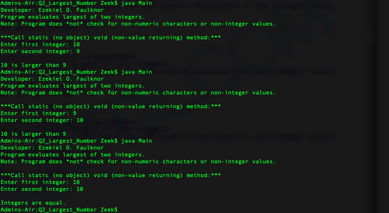
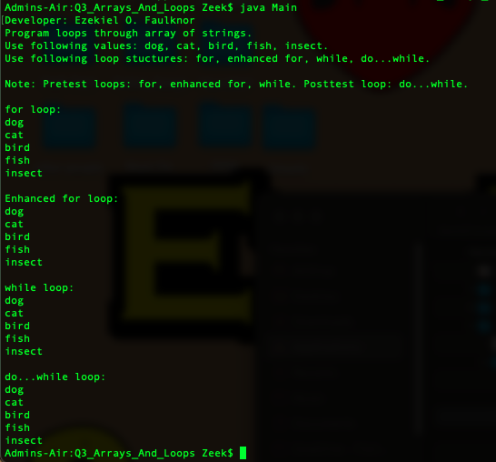
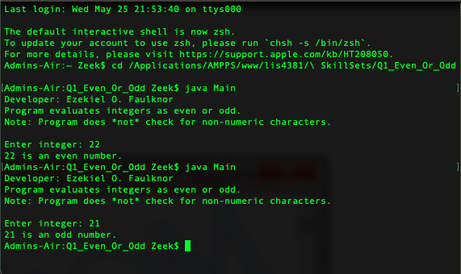

> **NOTE:** This README.md file should be placed at the **root of each of your repos directories.**
>
>Also, this file **must** use Markdown syntax, and provide project documentation as per below--otherwise, points **will** be deducted.
>

# Course Title

## Your Name

### Assignment # Requirements:

*Sub-Heading:*

1. Screenshots user interface
2. Java Skillsets 
3. Git commands

#### README.md file should include the following items:

* Screenshots of first user interface
* Screenshots of second user interface
* Screenshots of running java Even or Odd
* Screenshots of running java Largest Number
* Screenshots of running java Arrays And Loops

Screenshots

> This is a blockquote.
> 
> This is the second paragraph in the blockquote.
>
> #### Git commands w/short descriptions:

1. git add - Add one or more files to staging
2. git commit - Commit changes to head (but not yet to the remote repository)
3. git push - Send changes to the master branch of your remote repository

#### Assignment Screenshots:

|*Screenshots of first user interface*: | *Screenshots of second user interface*: | 
| ----------- | ----------- |
|  |  |

|*Screenshots of running java Largest Number*: | *Screenshots of running java Arrays And Loops*: | *Screenshots of running java Even or Odd*: |
| ----------- | ----------- | ----------- | 
| | | 

