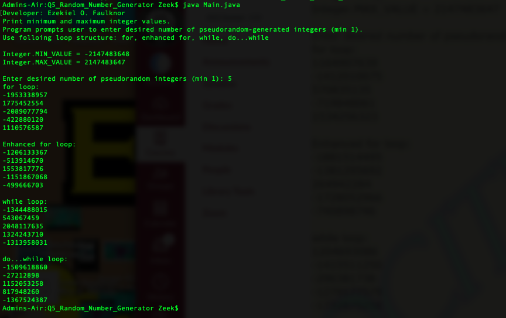
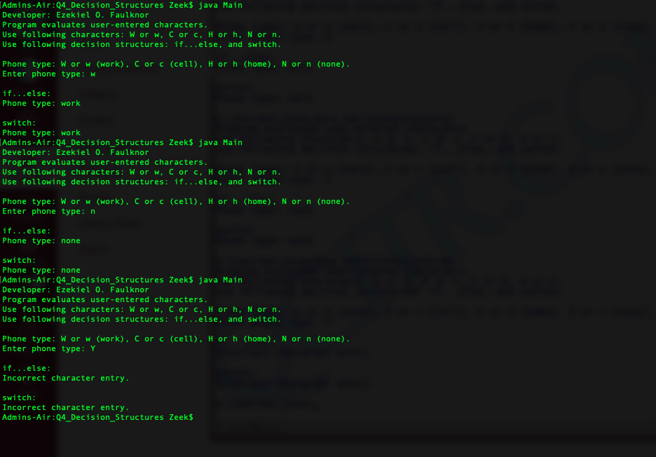
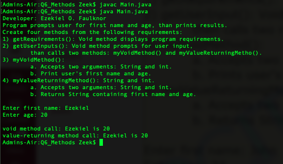
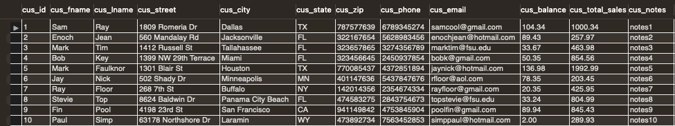
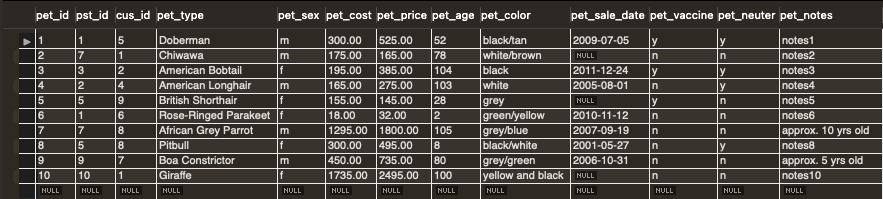
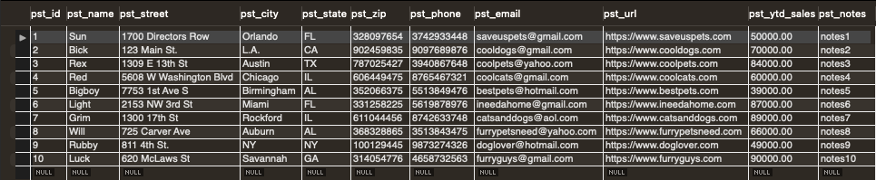
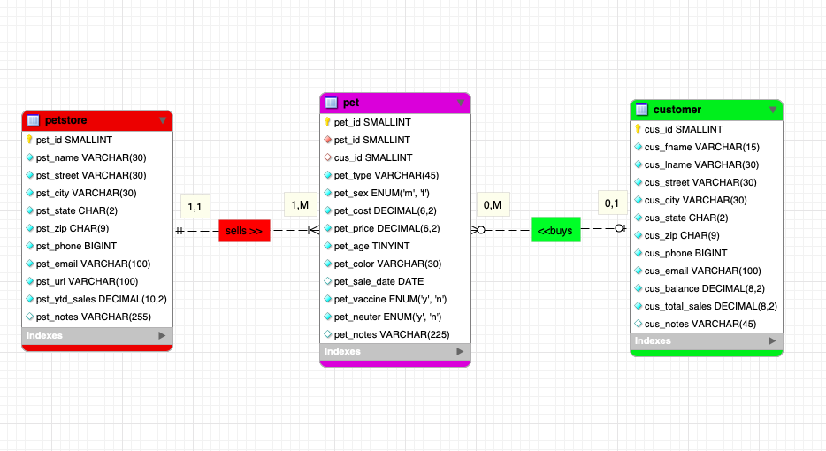

> **NOTE:** This README.md file should be placed at the **root of each of your repos directories.**
>
>Also, this file **must** use Markdown syntax, and provide project documentation as per below--otherwise, points **will** be deducted.
>

# Course Title

## Ezekiel Faulknor 

### LIS4381 Requirements:

*Sub-Heading:*

1. Screenshots user interface and ERD
2. Java Skillsets 

#### README.md file should include the following items:

* Screenshot of ERD; 
* Screenshot of running applications opening user interface;
* Screenshot of running applications processing user input;
* Screenshots of 10 records for each table use (select * from each table)
* Links to the following files: 
    * a3.mwb 
    * a3.sql

Screenshots

> This is a blockquote.
> 
> This is the second paragraph in the blockquote.
>
> #### Git commands w/short descriptions:

1. git add - Add one or more files to staging
2. git commit - Commit changes to head (but not yet to the remote repository)
3. git push - Send changes to the master branch of your remote repository

#### Assignment Screenshots:

|*Screenshots of opening user interface*: | *Screenshots of processing user interface*: | 
| ----------- | ----------- |
|  |  |

|*Screenshots of running java Random Number Generator*: | *Screenshots of running java Decision Structures*: | *Screenshots of running java Methods*: |
| ----------- | ----------- | ----------- | 
| | | 

|*Screenshots of 10 customer records*: | *Screenshots of 10 pet records*: | *Screenshots of 10 petstore records*: |
| ----------- | ----------- | ----------- | 
| | | 

|*Screenshots of ERD*: |
| ----------- |
| |
