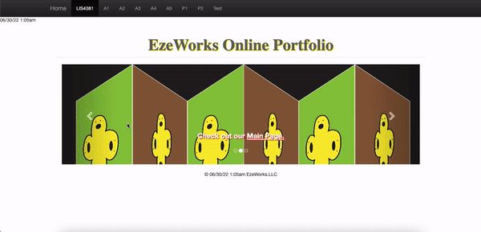
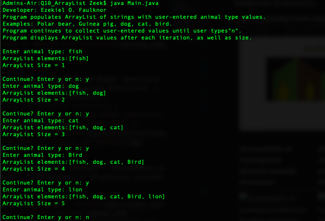
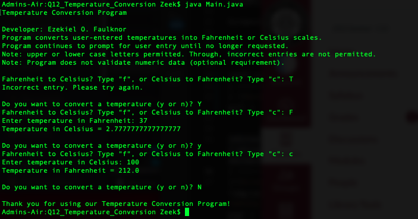
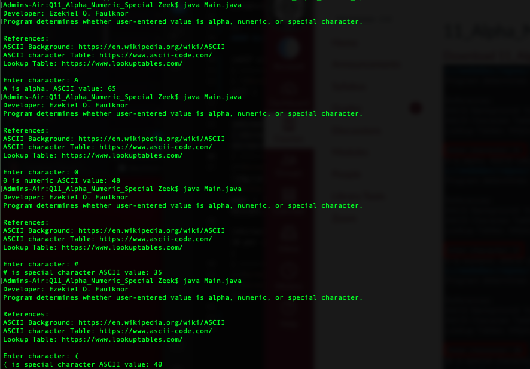
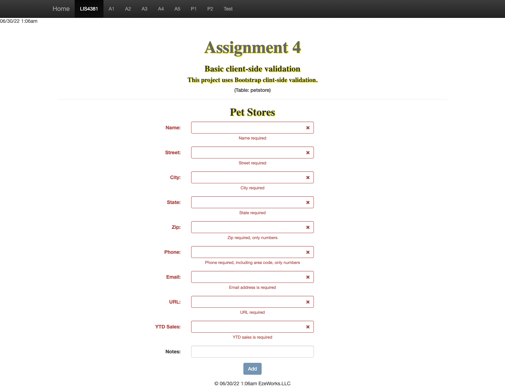
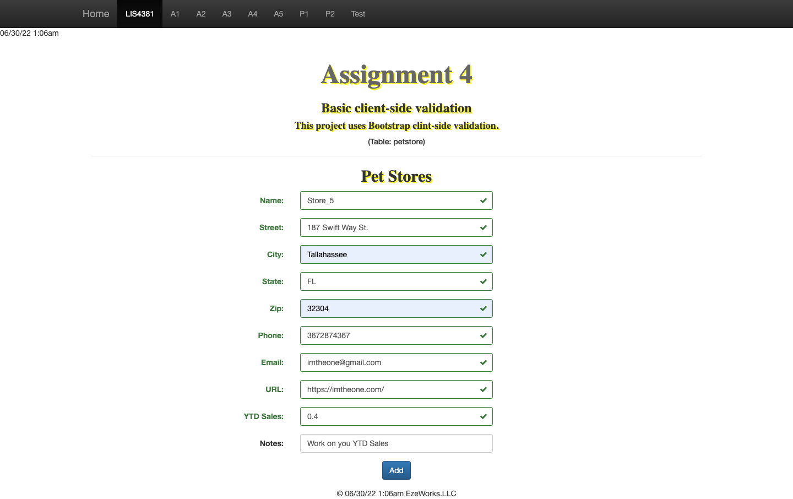
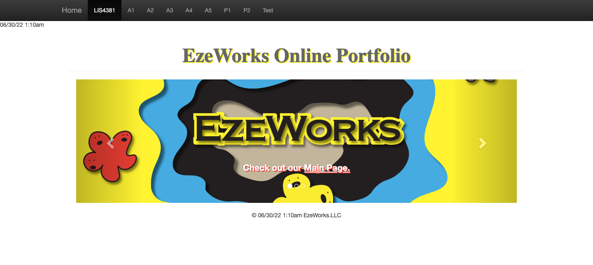

> **NOTE:** This README.md file should be placed at the **root of each of your repos directories.**
>
>Also, this file **must** use Markdown syntax, and provide project documentation as per below--otherwise, points **will** be deducted.
>

# Course Title

## Ezekiel Faulknor 

### LIS4381 Requirements:

*Sub-Heading:*

1. Screenshots user interface
2. Java Skillsets 

#### README.md file should include the following items:

* Screenshot of Failed Validation 
* Provide GIF of Running app
* Screenshot of Passed Validation 
* Screenshots of LIS4381 Portal (Main Page) 
* Link to local lis4381 web app: http://localhost/lis4381/ 

#### Assignment Screenshots:

|*GIF of opening home page interface*: | 
| ----------- |
|  |

|*Screenshots of running java ArrayList*: | *Screenshots of running java Temperature Conversion*: | *Screenshots of running java Alpha Numeric Special*: |
| ----------- | ----------- | ----------- | 
| | | 

|*Screenshots of Failed Validation*: | *Screenshots of Passed Validation*: | *Screenshots of 10 petstore records*: |
| ----------- | ----------- | ----------- | 
| | | 

