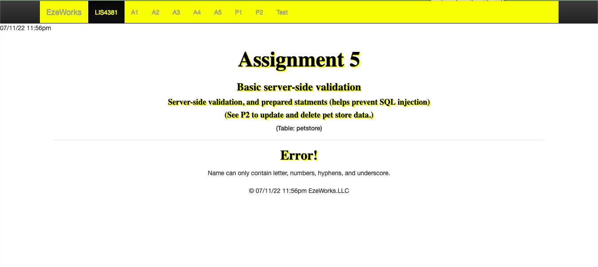

> **NOTE:** This README.md file should be placed at the **root of each of your repos directories.**
>
>Also, this file **must** use Markdown syntax, and provide project documentation as per below--otherwise, points **will** be deducted.
>

# Course Title

## Ezekiel Faulknor 

### LIS4381 Requirements:

*Sub-Heading:*

1. Screenshots user interface 
2. Java Skillsets 

#### README.md file should include the following items:

* Screenshot of running applications opening user interface;
* Screenshot of running applications processing user input;
* Screenshots of incorrect entry
* Screenshots of correct entry
* GIF of PHP: Simple Calculator
* GIF of PHP: Write/Read File

Screenshots

> This is a blockquote.
> 
> This is the second paragraph in the blockquote.
>
> #### Git commands w/short descriptions:

1. git add - Add one or more files to staging
2. git commit - Commit changes to head (but not yet to the remote repository)
3. git push - Send changes to the master branch of your remote repository

#### Assignment Screenshots:

|*Screenshots of opening user interface*: | *Screenshots of incorrect entry*: | 
| ----------- | ----------- |
|  |  |

|*Screenshots of error*: | *Screenshots of correct entry*: 
| ----------- | ----------- 
| | 

|*Screenshots of running java Sphere Volume Calculator*: 
| ----------- 
| 

| *Screenshots of PHP: Simple Calculator GIF*: 
| -----------
| | 

| *Screenshots of PHP: Write/Read File GIF*: 
| -----------
| | 