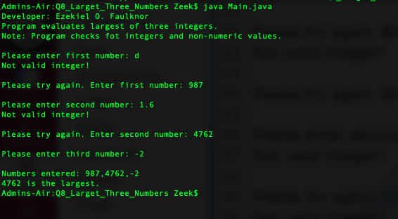
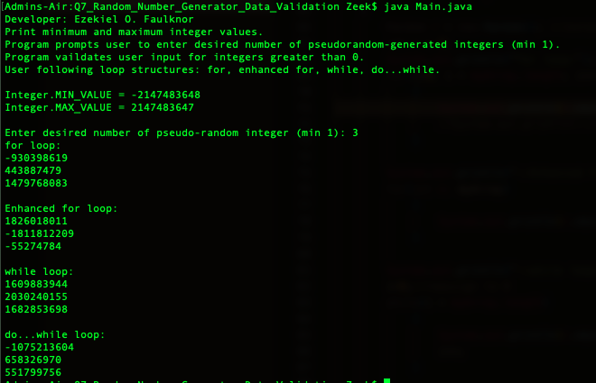

> **NOTE:** This README.md file should be placed at the **root of each of your repos directories.**
>
>Also, this file **must** use Markdown syntax, and provide project documentation as per below--otherwise, points **will** be deducted.
>

# Course Title

## Ezekiel Faulknor 

### LIS4381 Requirements:

*Sub-Heading:*

1. Screenshots user interface 
2. Java Skillsets 
3. Create a launcher icon image and display it in both activities (screens) 
4. Must add background color(s) to both activities 
5. Must add border around image and button 
6. Must add text shadow (button) 

#### README.md file should include the following items:

* Screenshot of running applications opening user interface;
* Screenshot of running applications processing user input;
* Screenshot of running Java in terminal;

#### Assignment Screenshots:

|*Screenshots of opening user interface*: | *Screenshots of processing user interface*: | 
| ----------- | ----------- |
|  |  |

|*Screenshots of running java Larget Three Numbers*: | *Screenshots of running java Random Number Generator Data Validation*: | *Screenshots of running java*: |
| ----------- | ----------- | ----------- | 
| | | 

