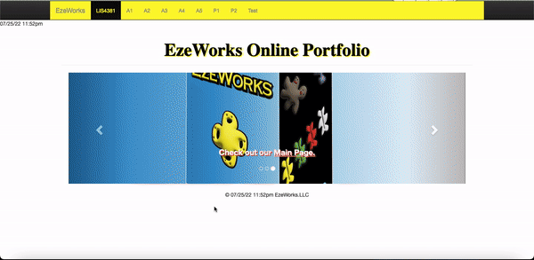
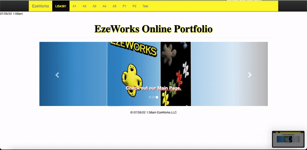
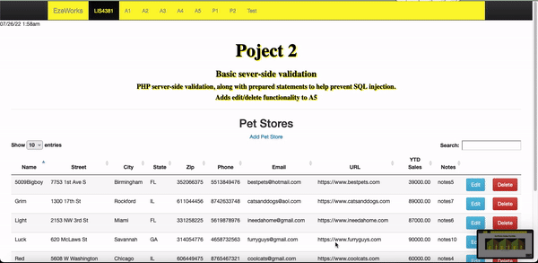
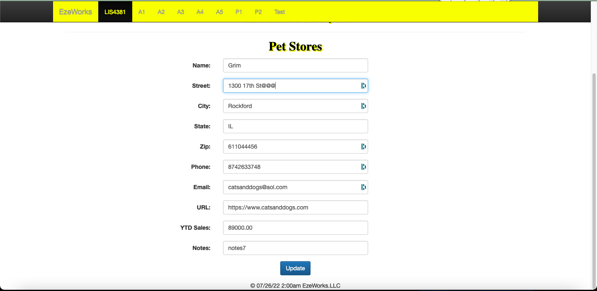
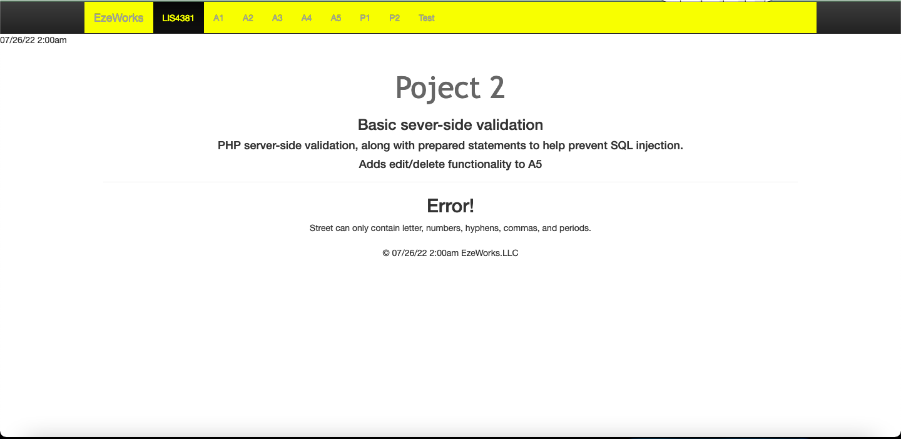
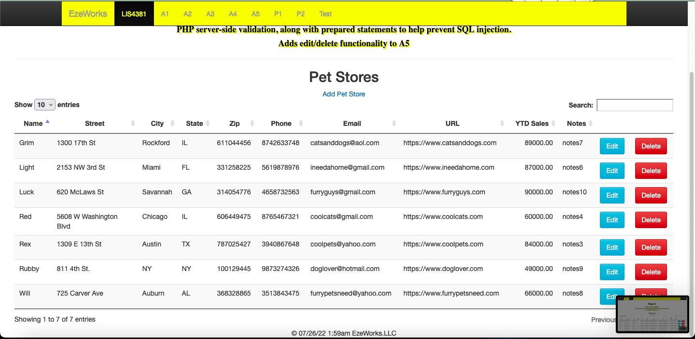
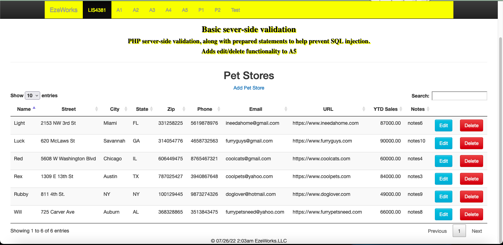

> **NOTE:** This README.md file should be placed at the **root of each of your repos directories.**
>
>Also, this file **must** use Markdown syntax, and provide project documentation as per below--otherwise, points **will** be deducted.
>

# Course Title

## Ezekiel Faulknor 

### LIS4381 Requirements:

*Sub-Heading:*

1. Screenshots user interface 

#### README.md file should include the following items:

* GIF of Before  and after successful edit ; 
* Screenshot of running Failed validation 
* Screenshot of running applications processing user input;
* GIF of Delete prompt and successfully deleted record
* Suitably modify meta tags 
* Change title, navigation links, and header tags appropriately 
* RSS feed 

Screenshots

#### Assignment Screenshots:

|*Screenshots of opening user interface*: 
| ----------- 
|  | 

|*Screenshots of edit button functionality*: 
| ----------- |
| 

|*Screenshots of delete button functionality*: |
| ----------- | 
| 

| Screenshots of wrong validation: | *Screenshots of Erorr index page*: 
| ----------- | ----------- 
| | | 

| Screenshots of Erorr index page: | *Screenshots of edit petstore wrong*: 
| ----------- | ----------- 
| | |

|*Screenshots of RSS feed*: |
| ----------- | 
| 
