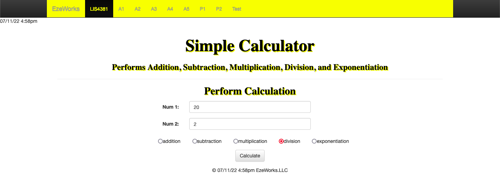
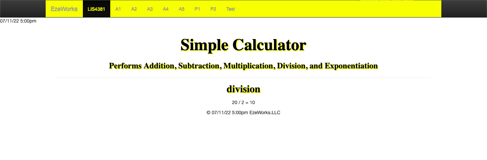
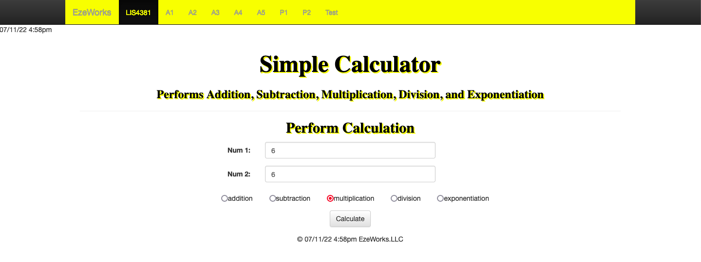

> **NOTE:** This README.md file should be placed at the **root of each of your repos directories.**
>
>Also, this file **must** use Markdown syntax, and provide project documentation as per below--otherwise, points **will** be deducted.
>

# Course Title

## Ezekiel Faulknor 

### LIS4381 Requirements:

*Sub-Heading:*

1. Java Skillsets 
2. Regular expression

#### README.md file should include the following items:

* Screenshot of PHP: Simple Calculator
* Screenshot of Passed Validation 
* Screenshots of LIS4381 Portal (Main Page) 
* Link to local lis4381 web app: 

#### Website Links:

*Website EzeWorks:*
[EzeWorks localhost ](http://localhost/lis4381/ "Website EzeWorks")

#### Assignment Screenshots:

| *Screenshots of PHP: Simple Calculator*: | *Screenshots of PHP: Simple Calculators*: |
| ----------- | -------
| | 

| *Screenshots of PHP: Simple Calculator*: | *Screenshots of PHP: Simple Calculator*: |
| ----------- | -------
| | 

